# Data Flow

## Overview

This document describes the data flow patterns within the Dokkerr platform, including request handling, data processing, and event propagation.

## Request Flow

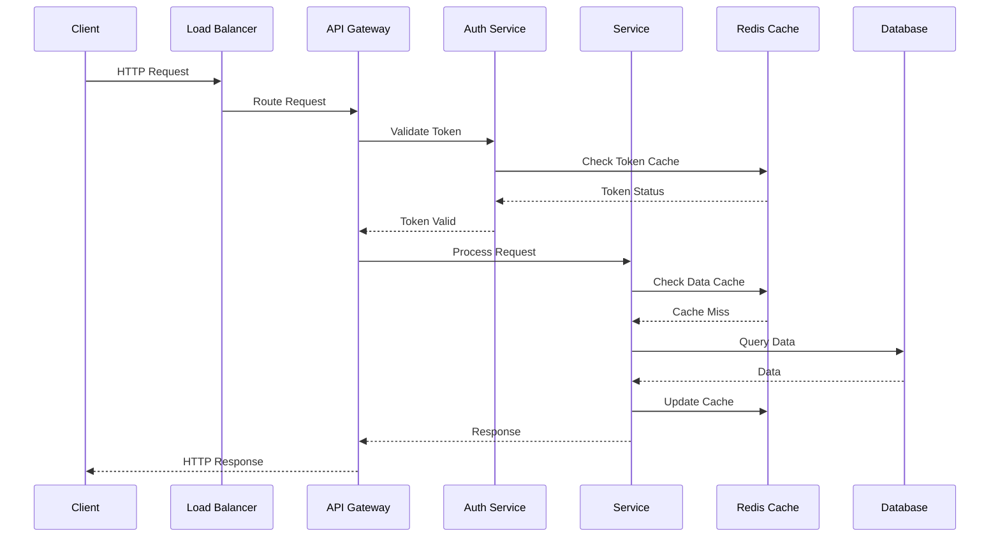

## Data Processing Pipeline

### Container Creation Flow
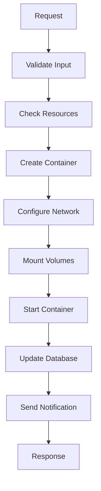

### Event Processing Flow
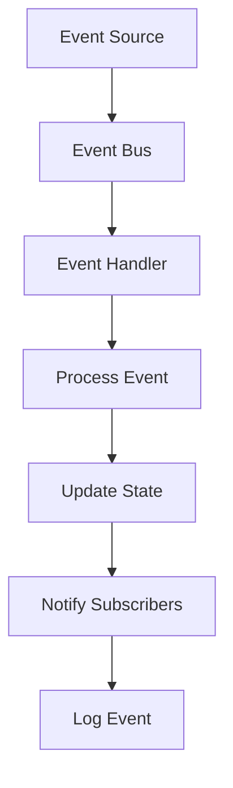

## Data Storage Patterns

### Write Path
1. Validate input data
2. Apply business rules
3. Write to primary database
4. Invalidate cache
5. Trigger events
6. Update search index

### Read Path
1. Check cache
2. If cache miss, read from database
3. Update cache
4. Transform data
5. Return response

## Caching Strategy

### Multi-level Caching
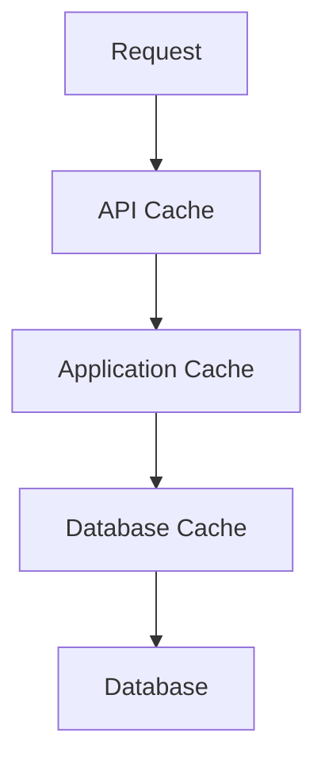

### Cache Invalidation
- Time-based expiration
- Event-based invalidation
- Manual purge
- Cascade invalidation

## Event Flow

### Event Publishing
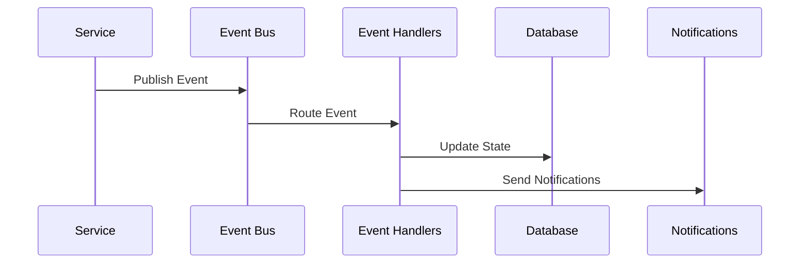

### Event Consumption
- Message queues
- Pub/sub channels
- Webhooks
- WebSocket streams

## Error Handling Flow

### Error Processing
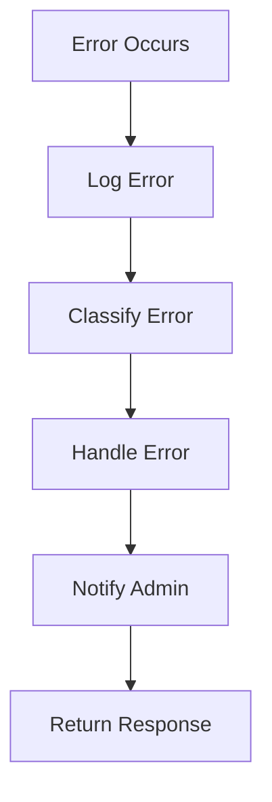

### Recovery Flow
1. Detect failure
2. Log incident
3. Attempt recovery
4. Notify stakeholders
5. Update status

## Backup Flow

### Data Backup
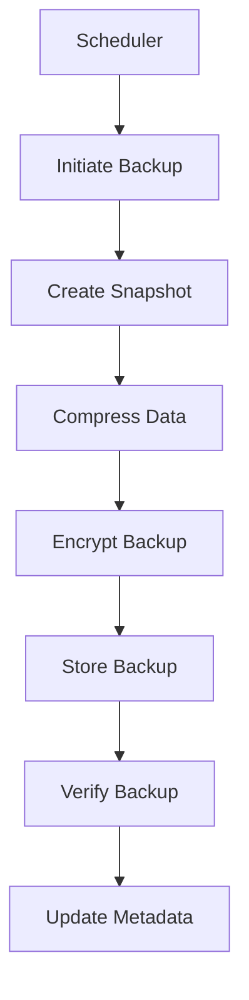

### Restore Flow
1. Select backup point
2. Verify backup integrity
3. Decrypt backup
4. Restore data
5. Verify restoration
6. Update system state

## Monitoring Flow

### Metrics Collection
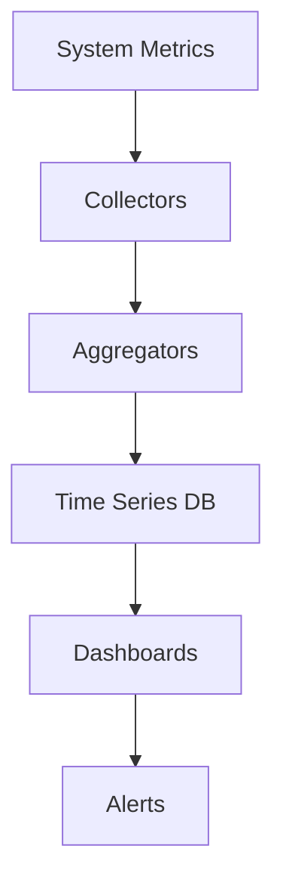

### Log Processing
1. Generate logs
2. Collect logs
3. Parse logs
4. Index logs
5. Archive logs
6. Query logs

## Security Flow

### Authentication Flow
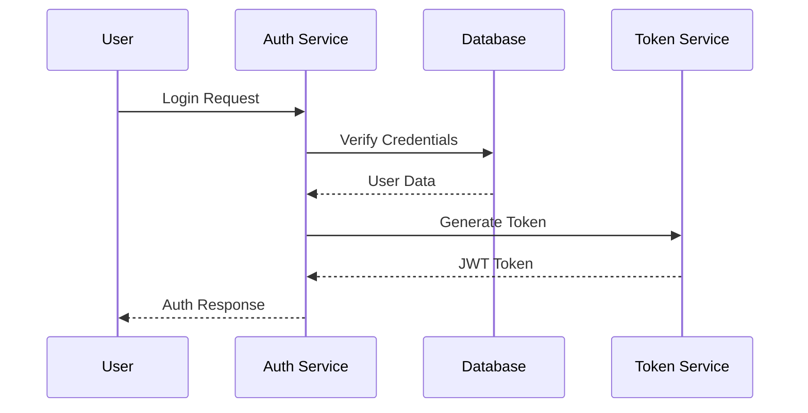

### Authorization Flow
1. Extract token
2. Validate token
3. Check permissions
4. Grant/deny access
5. Log decision

## Integration Flow

### External Service Integration
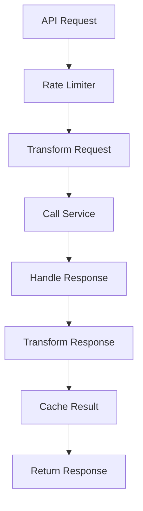

### Webhook Processing
1. Receive webhook
2. Validate signature
3. Parse payload
4. Process event
5. Send response
6. Log transaction

## Data Migration Flow

### Migration Process
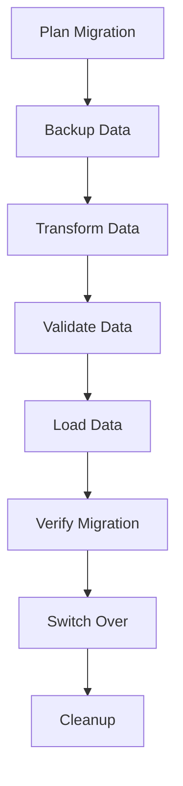

### Rollback Process
1. Detect issues
2. Stop migration
3. Restore backup
4. Verify state
5. Resume operations

## Deployment Flow

### Release Process
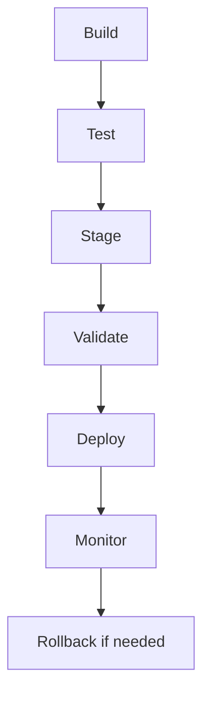

### Configuration Flow
1. Load config
2. Validate config
3. Apply config
4. Verify config
5. Update state 