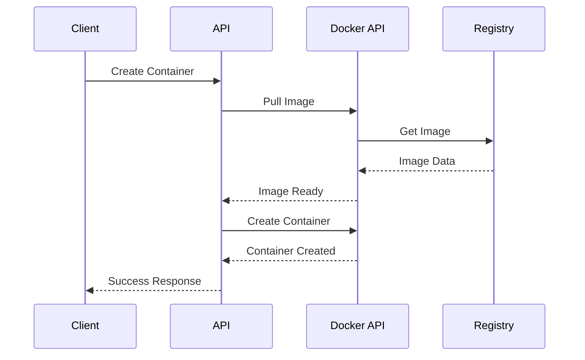
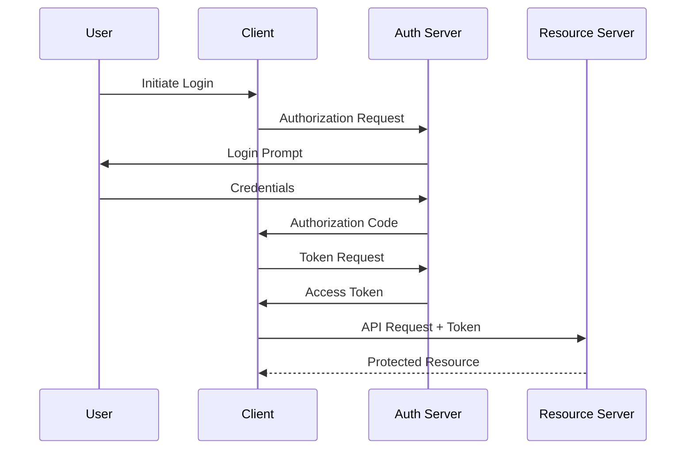
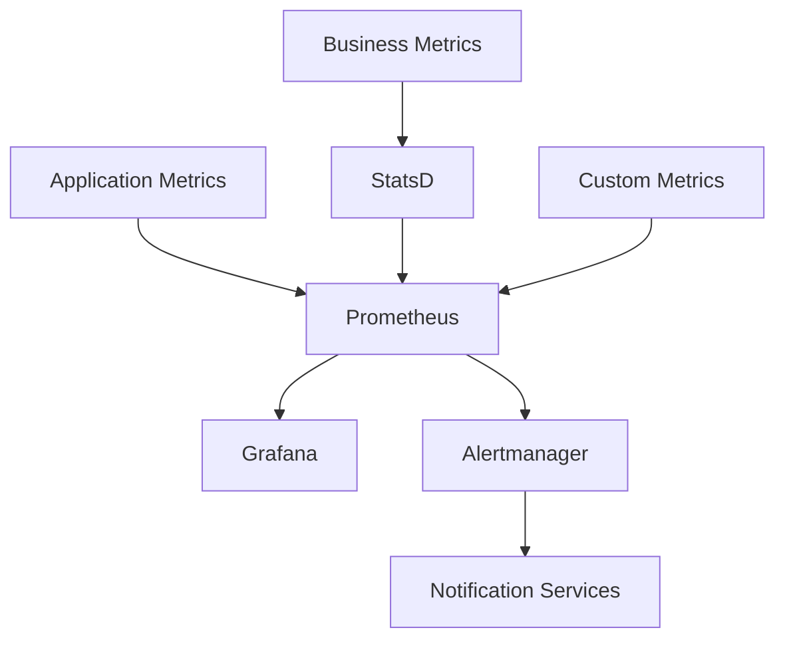

# Integration Guide

## Overview

This guide covers the integration points and patterns used in the Dokkerr platform, including APIs, webhooks, and external service integrations.

## API Integration

### REST API

```typescript
interface APIEndpoints {
  // Container Management
  'POST /api/v1/containers': CreateContainer;
  'GET /api/v1/containers': ListContainers;
  'GET /api/v1/containers/:id': GetContainer;
  'PUT /api/v1/containers/:id': UpdateContainer;
  'DELETE /api/v1/containers/:id': DeleteContainer;
  
  // User Management
  'POST /api/v1/users': CreateUser;
  'GET /api/v1/users': ListUsers;
  'GET /api/v1/users/:id': GetUser;
  'PUT /api/v1/users/:id': UpdateUser;
  'DELETE /api/v1/users/:id': DeleteUser;
  
  // Authentication
  'POST /api/v1/auth/login': Login;
  'POST /api/v1/auth/logout': Logout;
  'POST /api/v1/auth/refresh': RefreshToken;
  'POST /api/v1/auth/reset-password': ResetPassword;
}
```

### WebSocket API

```typescript
interface WebSocketEvents {
  // Container Events
  'container:created': ContainerCreated;
  'container:updated': ContainerUpdated;
  'container:deleted': ContainerDeleted;
  'container:started': ContainerStarted;
  'container:stopped': ContainerStopped;
  
  // System Events
  'system:alert': SystemAlert;
  'system:metric': SystemMetric;
  'system:log': SystemLog;
  
  // User Events
  'user:connected': UserConnected;
  'user:disconnected': UserDisconnected;
  'user:activity': UserActivity;
}
```

## External Service Integration

### Docker Integration



### Cloud Provider Integration

```typescript
interface CloudProviders {
  aws: {
    s3: StorageService;
    rds: DatabaseService;
    sns: NotificationService;
    cloudwatch: MonitoringService;
  };
  
  gcp: {
    storage: StorageService;
    sql: DatabaseService;
    pubsub: NotificationService;
    monitoring: MonitoringService;
  };
  
  azure: {
    blob: StorageService;
    sql: DatabaseService;
    servicebus: NotificationService;
    insights: MonitoringService;
  };
}
```

## Authentication Integration

### OAuth2 Flow



### SSO Integration

```typescript
interface SSOProviders {
  google: {
    clientId: string;
    clientSecret: string;
    redirectUri: string;
    scope: string[];
  };
  
  github: {
    clientId: string;
    clientSecret: string;
    redirectUri: string;
    scope: string[];
  };
  
  microsoft: {
    clientId: string;
    clientSecret: string;
    redirectUri: string;
    scope: string[];
  };
}
```

## Webhook Integration

### Webhook Configuration

```typescript
interface WebhookConfig {
  url: string;
  secret: string;
  events: string[];
  retryPolicy: {
    maxAttempts: number;
    backoffMultiplier: number;
    initialDelay: number;
  };
  timeout: number;
}
```

### Event Payload

```typescript
interface WebhookPayload {
  id: string;
  type: string;
  timestamp: string;
  data: Record<string, any>;
  signature: string;
}
```

## Monitoring Integration

### Metrics Integration



### Logging Integration

```typescript
interface LoggingIntegration {
  elasticsearch: {
    node: string;
    auth: {
      username: string;
      password: string;
    };
    index: string;
  };
  
  logstash: {
    host: string;
    port: number;
    protocol: 'udp' | 'tcp';
  };
  
  kibana: {
    host: string;
    dashboards: string[];
  };
}
```

## Storage Integration

### Object Storage

```typescript
interface StorageIntegration {
  provider: 'aws' | 'gcp' | 'azure';
  bucket: string;
  region: string;
  credentials: {
    accessKey: string;
    secretKey: string;
  };
  options: {
    encryption: boolean;
    compression: boolean;
    caching: boolean;
  };
}
```

### Database Integration

```typescript
interface DatabaseIntegration {
  primary: {
    host: string;
    port: number;
    database: string;
    user: string;
    password: string;
    ssl: boolean;
  };
  
  replicas: {
    host: string;
    port: number;
    database: string;
    user: string;
    password: string;
    ssl: boolean;
  }[];
}
```

## Message Queue Integration

### Queue Configuration

```typescript
interface QueueConfig {
  rabbitmq: {
    host: string;
    port: number;
    username: string;
    password: string;
    vhost: string;
  };
  
  exchanges: {
    name: string;
    type: 'direct' | 'fanout' | 'topic';
    options: {
      durable: boolean;
      autoDelete: boolean;
    };
  }[];
  
  queues: {
    name: string;
    options: {
      durable: boolean;
      deadLetterExchange: string;
      maxLength: number;
    };
  }[];
}
```

### Message Format

```typescript
interface Message {
  id: string;
  type: string;
  data: any;
  metadata: {
    timestamp: string;
    source: string;
    correlationId: string;
  };
  options: {
    priority: number;
    expiration: number;
    persistent: boolean;
  };
}
```

## Cache Integration

### Cache Configuration

```typescript
interface CacheConfig {
  redis: {
    host: string;
    port: number;
    password: string;
    db: number;
  };
  
  cluster: {
    nodes: {
      host: string;
      port: number;
    }[];
    options: {
      maxRedirections: number;
      retryDelay: number;
    };
  };
  
  options: {
    ttl: number;
    maxSize: number;
    compression: boolean;
  };
}
```

## Email Integration

### Email Configuration

```typescript
interface EmailConfig {
  provider: 'smtp' | 'sendgrid' | 'ses';
  
  smtp?: {
    host: string;
    port: number;
    secure: boolean;
    auth: {
      user: string;
      pass: string;
    };
  };
  
  sendgrid?: {
    apiKey: string;
    templates: Record<string, string>;
  };
  
  ses?: {
    accessKey: string;
    secretKey: string;
    region: string;
  };
}
```

## Integration Best Practices

### Security
- Use HTTPS/TLS for all communications
- Implement proper authentication
- Validate all inputs
- Use secure credentials storage
- Implement rate limiting

### Reliability
- Implement retry mechanisms
- Use circuit breakers
- Monitor integration health
- Implement fallback mechanisms
- Handle errors gracefully

### Performance
- Use connection pooling
- Implement caching
- Optimize payload sizes
- Use async operations
- Monitor performance metrics

### Maintenance
- Version all integrations
- Document all endpoints
- Monitor usage patterns
- Regular security audits
- Keep dependencies updated 