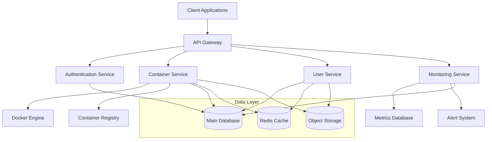

# System Architecture Overview

The Dokkerr platform is built on a modern, scalable architecture designed to handle Docker container management efficiently and securely. This document provides a high-level overview of the system architecture and its key components.

## Architecture Diagram

## Core Components

### 1. API Gateway
- Central entry point for all client requests
- Request routing and load balancing
- Rate limiting and throttling
- API versioning
- Request/response transformation

### 2. Authentication Service
- User authentication and authorization
- JWT token management
- OAuth2 integration
- Role-based access control (RBAC)
- Session management

### 3. Container Service
- Docker container lifecycle management
- Container orchestration
- Image management
- Network configuration
- Volume management

### 4. User Service
- User account management
- Profile management
- Preferences and settings
- Team and organization management
- Billing integration

### 5. Monitoring Service
- Real-time container metrics
- System health monitoring
- Resource usage tracking
- Alert management
- Performance analytics

## Data Layer

### Main Database (PostgreSQL)
- User data
- Container configurations
- System settings
- Audit logs
- Metrics history

### Cache Layer (Redis)
- Session data
- Frequently accessed configurations
- Rate limiting data
- Real-time metrics

### Object Storage (S3)
- Container images
- Backup files
- User uploads
- System logs

## Security Architecture

### Authentication
- JWT-based authentication
- Multi-factor authentication
- OAuth2 provider integration
- Session management
- API key management

### Authorization
- Role-based access control (RBAC)
- Resource-level permissions
- Team-based access
- API scope control
- Audit logging

### Network Security
- TLS encryption
- Network isolation
- Container network policies
- Firewall rules
- DDoS protection

## Scalability

### Horizontal Scaling
- Containerized microservices
- Load balancer configuration
- Database replication
- Cache clustering
- Storage distribution

### Performance Optimization
- Query optimization
- Cache strategies
- Connection pooling
- Resource allocation
- Load distribution

## Monitoring & Logging

### System Monitoring
- Container health checks
- Resource utilization
- Performance metrics
- Error tracking
- Uptime monitoring

### Logging System
- Centralized logging
- Log aggregation
- Search capabilities
- Retention policies
- Audit trails

## Deployment Architecture

### Container Orchestration
- Kubernetes integration
- Service discovery
- Auto-scaling
- Rolling updates
- Health checks

### CI/CD Pipeline
- Automated testing
- Continuous integration
- Deployment automation
- Version control
- Environment management

## Integration Points

### External Services
- Container registries
- Cloud providers
- Monitoring services
- Authentication providers
- Storage services

### APIs and Webhooks
- RESTful APIs
- WebSocket connections
- Event webhooks
- Service integrations
- Custom extensions

## Best Practices

### Development
- Code standards
- Testing requirements
- Documentation
- Version control
- Code review process

### Operations
- Backup procedures
- Disaster recovery
- Security updates
- Performance tuning
- Incident response

## Future Considerations

### Planned Improvements
- Enhanced monitoring
- Advanced analytics
- Additional integrations
- Security enhancements
- Performance optimizations

### Scalability Plans
- Multi-region support
- Enhanced caching
- Database sharding
- Load distribution
- Resource optimization 