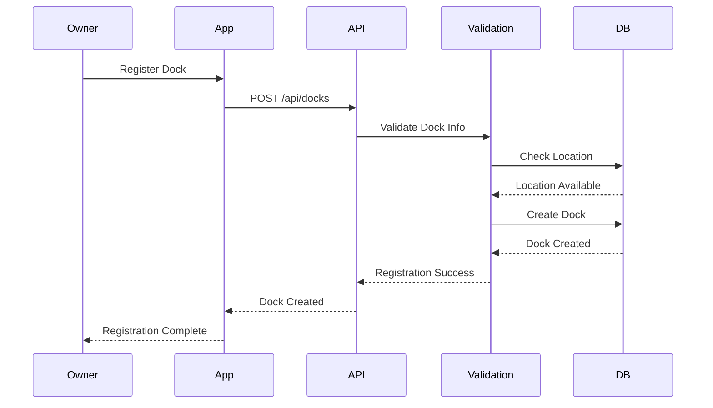
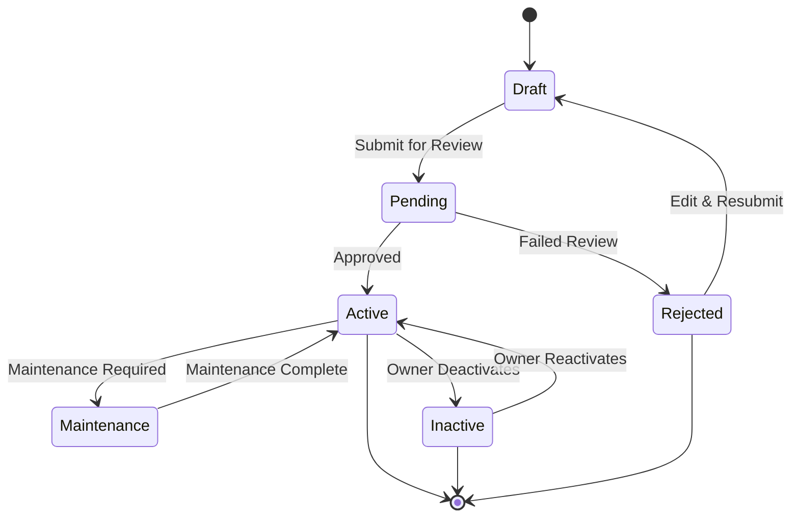

# Dock Management

This document details the dock management system implementation in the Dokkerr application.

## Dock Registration Flow

## Dock States

## Dock Components

### 1. Dock Information
- **Basic Details**
  - Location
  - Dimensions
  - Capacity
  - Amenities

- **Technical Specs**
  - Power supply
  - Water supply
  - Security features
  - Maintenance requirements

### 2. Pricing Management
- **Rate Structure**
  - Base rates
  - Seasonal rates
  - Special rates
  - Discounts

- **Fee Management**
  - Cleaning fees
  - Security deposits
  - Insurance fees
  - Maintenance fees

### 3. Availability Management
- **Calendar System**
  - Blocked dates
  - Maintenance schedule
  - Special events
  - Seasonal availability

- **Booking Rules**
  - Minimum stay
  - Maximum stay
  - Advance booking
  - Cancellation policy

### 4. Maintenance System
- **Maintenance Types**
  - Regular maintenance
  - Emergency repairs
  - Seasonal checks
  - Equipment updates

- **Maintenance Process**
  - Issue reporting
  - Work scheduling
  - Status tracking
  - Cost management

## Owner Interface

### 1. Dashboard
- **Overview**
  - Booking status
  - Revenue metrics
  - Occupancy rate
  - Maintenance status

- **Quick Actions**
  - Update availability
  - Manage bookings
  - Handle maintenance
  - Update pricing

### 2. Management Tools
- **Booking Management**
  - View bookings
  - Accept/reject requests
  - Handle cancellations
  - Manage extensions

- **Financial Tools**
  - Revenue tracking
  - Expense management
  - Payment processing
  - Financial reports

## Dock Operations

### 1. Daily Operations
- **Check-in/out**
  - Process check-ins
  - Handle check-outs
  - Issue keys/access
  - Collect feedback

- **Maintenance**
  - Regular cleaning
  - Equipment checks
  - Safety inspections
  - Emergency response

### 2. Emergency Procedures
- **Response Protocol**
  - Emergency contacts
  - Response time
  - Escalation process
  - Documentation

- **Safety Measures**
  - Emergency equipment
  - Safety protocols
  - Evacuation plans
  - Insurance coverage

## Dock Analytics

### 1. Performance Metrics
- **Occupancy**
  - Occupancy rate
  - Peak times
  - Seasonal patterns
  - Revenue per day

- **Financial**
  - Revenue analysis
  - Cost tracking
  - Profit margins
  - ROI calculation

### 2. Customer Insights
- **Usage Patterns**
  - Popular times
  - Customer types
  - Booking patterns
  - Length of stay

- **Feedback Analysis**
  - Customer reviews
  - Satisfaction scores
  - Common issues
  - Improvement areas

## Integration Points

### 1. External Services
- **Mapping Services**
  - Location services
  - Navigation
  - Geocoding
  - Distance calculation

- **Weather Services**
  - Weather forecasts
  - Tide information
  - Storm alerts
  - Seasonal data

### 2. Internal Systems
- **Booking System**
  - Availability sync
  - Booking updates
  - Payment processing
  - Notification system

- **User System**
  - Owner profiles
  - Customer profiles
  - Access control
  - Communication

## Compliance and Regulations

### 1. Legal Requirements
- **Licensing**
  - Business licenses
  - Permits
  - Insurance
  - Tax compliance

- **Safety Standards**
  - Building codes
  - Safety regulations
  - Environmental rules
  - Zoning laws

### 2. Documentation
- **Required Documents**
  - Insurance policies
  - Safety certificates
  - Maintenance records
  - Inspection reports

- **Record Keeping**
  - Booking records
  - Maintenance logs
  - Incident reports
  - Financial records

## Reporting System

### 1. Operational Reports
- **Daily Reports**
  - Occupancy status
  - Maintenance tasks
  - Incident reports
  - Revenue summary

- **Periodic Reports**
  - Monthly performance
  - Quarterly analysis
  - Annual review
  - Trend analysis

### 2. Financial Reports
- **Revenue Reports**
  - Daily revenue
  - Monthly income
  - Seasonal trends
  - Year-over-year

- **Expense Reports**
  - Maintenance costs
  - Operating expenses
  - Marketing spend
  - Profit analysis 