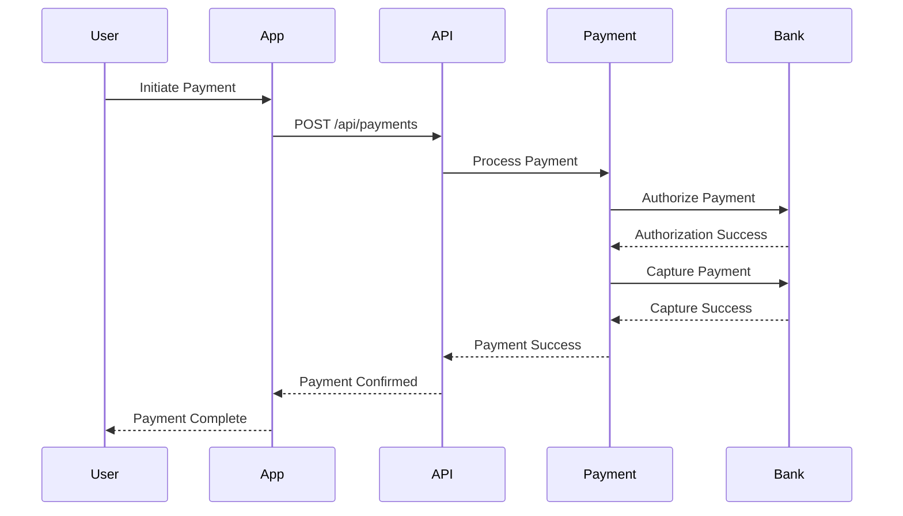
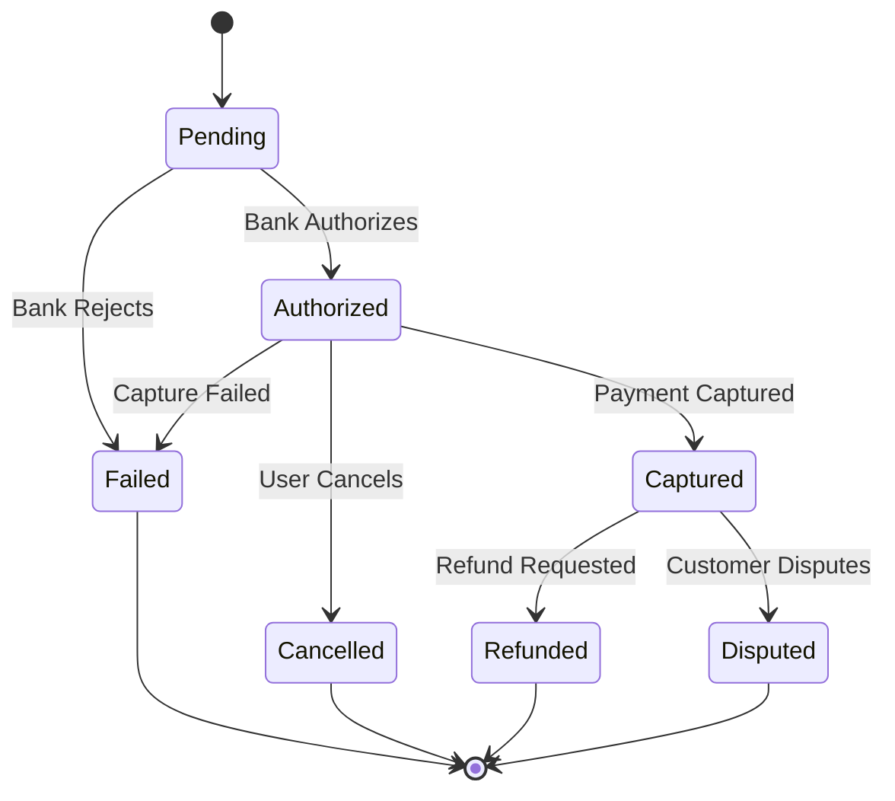

# Payment Processing

This document details the payment processing system implementation in the Dokkerr application.

## Payment Flow

## Payment States

## Payment Components

### 1. Payment Methods
- **Supported Methods**
  - Credit/Debit Cards
  - Digital Wallets
  - Bank Transfers
  - Cryptocurrency

- **Method Management**
  - Method validation
  - Tokenization
  - Method storage
  - Method updates

### 2. Payment Processing
- **Authorization**
  - Card validation
  - Balance check
  - Risk assessment
  - Fraud detection

- **Capture**
  - Amount verification
  - Currency conversion
  - Fee calculation
  - Settlement

### 3. Refund Processing
- **Refund Types**
  - Full refund
  - Partial refund
  - Cancellation refund
  - Dispute refund

- **Refund Flow**
  - Refund request
  - Amount validation
  - Bank processing
  - Status tracking

### 4. Dispute Handling
- **Dispute Types**
  - Chargeback
  - Dispute claim
  - Fraud report
  - Quality issue

- **Resolution Process**
  - Dispute receipt
  - Evidence collection
  - Response submission
  - Resolution tracking

## Security Implementation

### 1. Payment Security
- **Data Protection**
  - PCI compliance
  - Encryption
  - Tokenization
  - Secure storage

- **Authentication**
  - 3D Secure
  - Biometric auth
  - Two-factor auth
  - Session management

### 2. Fraud Prevention
- **Risk Assessment**
  - Transaction scoring
  - IP analysis
  - Device fingerprinting
  - Behavior analysis

- **Fraud Detection**
  - Pattern recognition
  - Anomaly detection
  - Velocity checks
  - Geographic validation

## Integration Points

### 1. Payment Gateways
- **Gateway Integration**
  - Stripe
  - PayPal
  - Local gateways
  - Alternative methods

- **Gateway Management**
  - Configuration
  - Fallback options
  - Error handling
  - Status monitoring

### 2. Banking Systems
- **Bank Integration**
  - Account linking
  - Balance checks
  - Transfer processing
  - Reconciliation

- **Settlement Process**
  - Settlement timing
  - Fee calculation
  - Currency conversion
  - Reporting

## Business Rules

### 1. Payment Rules
- **Amount Rules**
  - Minimum amount
  - Maximum amount
  - Currency limits
  - Fee structure

- **Timing Rules**
  - Processing time
  - Hold periods
  - Refund windows
  - Dispute deadlines

### 2. Fee Structure
- **Fee Types**
  - Processing fees
  - Currency fees
  - Refund fees
  - Dispute fees

- **Fee Calculation**
  - Percentage based
  - Fixed amount
  - Tiered pricing
  - Special rates

## Reporting and Analytics

### 1. Payment Analytics
- **Transaction Metrics**
  - Success rate
  - Failure rate
  - Average amount
  - Method distribution

- **Financial Metrics**
  - Revenue
  - Fees
  - Refunds
  - Disputes

### 2. Risk Analytics
- **Risk Metrics**
  - Fraud rate
  - Dispute rate
  - Chargeback rate
  - Risk score

- **Trend Analysis**
  - Method trends
  - Geographic patterns
  - Time patterns
  - Risk patterns

## Compliance and Regulations

### 1. Regulatory Compliance
- **Standards**
  - PCI DSS
  - GDPR
  - PSD2
  - Local regulations

- **Requirements**
  - Data protection
  - Reporting
  - Auditing
  - Documentation

### 2. Internal Controls
- **Process Controls**
  - Authorization limits
  - Approval workflows
  - Audit trails
  - Reconciliation

- **System Controls**
  - Access control
  - Change management
  - Backup procedures
  - Monitoring 