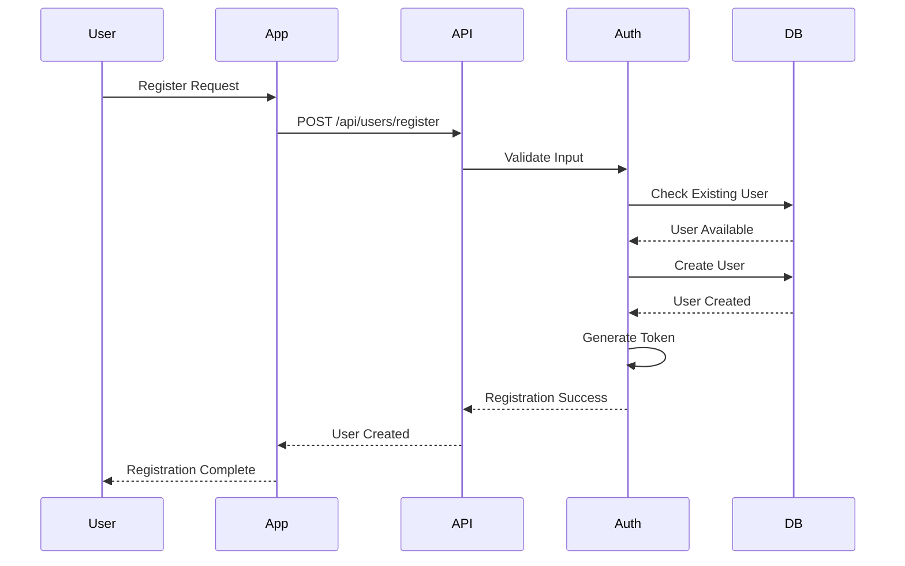
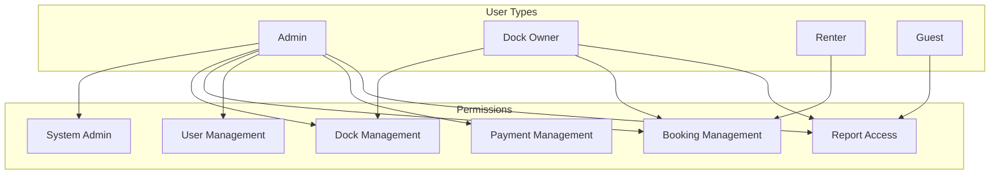

# User Management

This document details the user management system implementation in the Dokkerr application.

## User Registration Flow

## User Roles and Permissions

## User Profile Management

### 1. Profile Information
- **Basic Information**
  - Personal details
  - Contact information
  - Profile picture
  - Preferences

- **Verification**
  - Email verification
  - Phone verification
  - Identity verification
  - Address verification

### 2. Account Settings
- **Security Settings**
  - Password management
  - Two-factor auth
  - Login history
  - Device management

- **Notification Settings**
  - Email preferences
  - Push notifications
  - SMS notifications
  - Marketing preferences

## Authentication System

### 1. Login Methods
- **Standard Login**
  - Email/password
  - Phone/password
  - Username/password
  - Remember me

- **Social Login**
  - Google
  - Facebook
  - Apple
  - LinkedIn

### 2. Password Management
- **Password Rules**
  - Complexity requirements
  - Expiration policy
  - History tracking
  - Reset process

- **Recovery Options**
  - Email recovery
  - Phone recovery
  - Security questions
  - Admin reset

## User Data Management

### 1. Data Storage
- **Profile Data**
  - Personal information
  - Contact details
  - Preferences
  - Activity history

- **Security Data**
  - Authentication tokens
  - Session data
  - Security settings
  - Access logs

### 2. Data Privacy
- **Privacy Controls**
  - Data visibility
  - Sharing settings
  - Data export
  - Data deletion

- **Compliance**
  - GDPR compliance
  - Data retention
  - User consent
  - Privacy policy

## User Communication

### 1. Notification System
- **System Notifications**
  - Account updates
  - Security alerts
  - System maintenance
  - Policy changes

- **Business Notifications**
  - Booking updates
  - Payment notifications
  - Dock availability
  - Special offers

### 2. Communication Channels
- **Primary Channels**
  - Email
  - SMS
  - Push notifications
  - In-app messages

- **Support Channels**
  - Help center
  - Live chat
  - Support tickets
  - FAQ

## User Analytics

### 1. User Behavior
- **Activity Tracking**
  - Login patterns
  - Feature usage
  - Search patterns
  - Booking behavior

- **Engagement Metrics**
  - Session duration
  - Feature adoption
  - Return rate
  - User satisfaction

### 2. Performance Metrics
- **User Metrics**
  - Registration rate
  - Conversion rate
  - Retention rate
  - Churn rate

- **Business Impact**
  - Revenue per user
  - Customer lifetime value
  - Support costs
  - User acquisition cost

## Administrative Tools

### 1. User Management
- **Admin Controls**
  - User creation
  - Role assignment
  - Status management
  - Access control

- **Bulk Operations**
  - User import
  - Role updates
  - Status changes
  - Data export

### 2. Monitoring Tools
- **Activity Monitoring**
  - User sessions
  - Login attempts
  - Feature usage
  - Error tracking

- **Security Monitoring**
  - Suspicious activity
  - Failed logins
  - Access patterns
  - Security alerts

## Integration Points

### 1. External Services
- **Identity Providers**
  - OAuth providers
  - SSO systems
  - Identity verification
  - Social networks

- **Communication Services**
  - Email service
  - SMS service
  - Push notification
  - Chat service

### 2. Internal Systems
- **Business Systems**
  - Booking system
  - Payment system
  - Inventory system
  - Reporting system

- **Support Systems**
  - Help desk
  - Knowledge base
  - Feedback system
  - Analytics system 