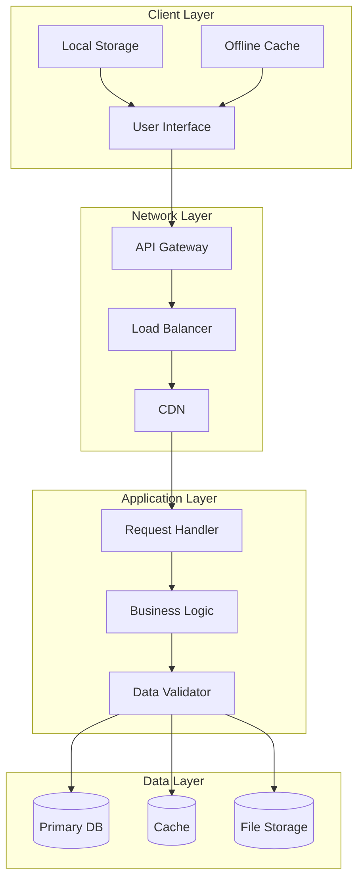
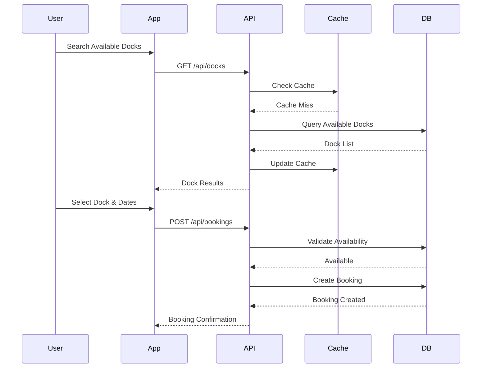
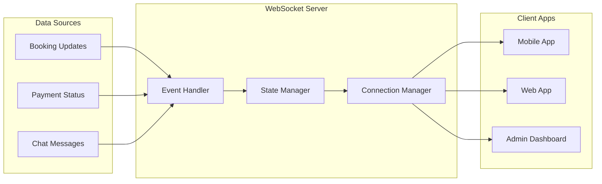

# Data Flow

This document describes the data flow patterns and processes within the Dokkerr application.

## System Data Flow

## Booking Flow Data

## Real-time Data Flow

## Data Processing Pipeline

### 1. Data Ingestion
- **Input Sources**
  - User interactions
  - API requests
  - WebSocket events
  - Background jobs
  - External integrations

- **Validation Layer**
  - Schema validation
  - Business rule validation
  - Security validation
  - Rate limiting

### 2. Processing Layer
- **Business Logic**
  - Booking processing
  - Payment handling
  - Notification generation
  - Analytics computation

- **Data Transformation**
  - Format conversion
  - Data enrichment
  - Aggregation
  - Normalization

### 3. Storage Layer
- **Primary Storage**
  - Relational data (PostgreSQL)
  - Document data (MongoDB)
  - File storage (AWS S3)

- **Caching Strategy**
  - In-memory cache (Redis)
  - CDN caching
  - Browser caching
  - Application cache

## Data Consistency

### 1. Transaction Management
- ACID compliance
- Distributed transactions
- Rollback mechanisms
- Deadlock prevention

### 2. Data Replication
- Primary-replica setup
- Read replicas
- Write sharding
- Data synchronization

### 3. Conflict Resolution
- Optimistic locking
- Version control
- Merge strategies
- Conflict detection

## Performance Optimization

### 1. Query Optimization
- Index management
- Query caching
- Connection pooling
- Query rewriting

### 2. Data Access Patterns
- Batch processing
- Bulk operations
- Lazy loading
- Pagination

### 3. Resource Management
- Memory optimization
- CPU utilization
- Network efficiency
- Storage optimization

## Monitoring and Analytics

### 1. Data Flow Metrics
- Request latency
- Throughput
- Error rates
- Cache hit rates

### 2. System Health
- Resource utilization
- Connection status
- Queue lengths
- Processing times

### 3. Business Analytics
- User behavior
- Booking patterns
- Revenue metrics
 