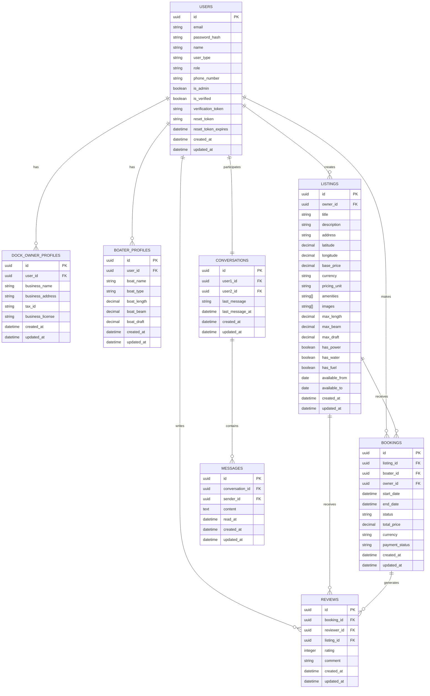

# Database Schema

This document outlines the database structure for the Dokkerr application.

## Database Architecture

Dokkerr uses PostgreSQL as its primary data store with a carefully designed schema to support the application's features and ensure optimal performance.



## Table Descriptions

### Users
Stores user authentication and basic profile information.
- Added `role` column to distinguish between regular users and administrators.

### Dock Owner Profiles
Stores additional information specific to dock owners.

### Boater Profiles
Stores information about the boater's vessel.

### Listings
Contains dock listing information including location, pricing, and specifications.

### Bookings
Tracks reservations of dock slips by boaters.

### Reviews
Stores ratings and feedback for listings based on completed bookings.

### Conversations
Represents a conversation between two users.

### Messages
Contains individual messages within a conversation.

## Indexes and Performance Optimizations

To ensure optimal query performance, the database includes the following indexes:

### Location-Based Search Indexes
```sql
CREATE INDEX idx_listings_location ON listings USING gist (
  ll_to_earth(latitude, longitude)
);
```
This spatial index enables efficient proximity searches for listings near a specified location.

### Common Query Pattern Indexes
```sql
-- User lookup by email (login/registration)
CREATE INDEX idx_users_email ON users(email);

-- Listings by owner
CREATE INDEX idx_listings_owner_id ON listings(owner_id);

-- Listings by availability dates
CREATE INDEX idx_listings_availability ON listings(available_from, available_to);

-- Bookings by status
CREATE INDEX idx_bookings_status ON bookings(status);

-- Bookings by date range
CREATE INDEX idx_bookings_dates ON bookings(start_date, end_date);

-- Bookings by user
CREATE INDEX idx_bookings_boater_id ON bookings(boater_id);
CREATE INDEX idx_bookings_owner_id ON bookings(owner_id);

-- Messages by conversation
CREATE INDEX idx_messages_conversation_id ON messages(conversation_id);

-- Unread messages
CREATE INDEX idx_messages_read_at ON messages(read_at) WHERE read_at IS NULL;

-- Reviews by listing
CREATE INDEX idx_reviews_listing_id ON reviews(listing_id);
```

## Database Triggers

### Updated Timestamp Triggers
Each table includes triggers to automatically update the `updated_at` timestamp when a record is modified:

```sql
CREATE OR REPLACE FUNCTION update_updated_at_column()
RETURNS TRIGGER AS $$
BEGIN
    NEW.updated_at = NOW();
    RETURN NEW;
END;
$$ LANGUAGE plpgsql;

CREATE TRIGGER update_users_updated_at BEFORE UPDATE ON users
FOR EACH ROW EXECUTE FUNCTION update_updated_at_column();
```

Similar triggers exist for all tables.

## Data Integrity

The database schema enforces data integrity through:

1. **Foreign Key Constraints**: Ensures relationships between tables are maintained
2. **Check Constraints**: Validates data values (e.g., rating values between 1-5)
3. **Not Null Constraints**: Ensures required data is provided
4. **Unique Constraints**: Prevents duplicate records where appropriate

## Database Migrations

Database changes are managed through migration scripts found in `src/migrations/`. The migration system ensures:

1. Schema changes are versioned
2. Migrations can be applied sequentially
3. The development environment matches production

## Connection Pooling

The application uses connection pooling to efficiently manage database connections:

```javascript
const pool = new Pool({
  connectionString: process.env.DATABASE_URL,
  ssl: process.env.NODE_ENV === 'production' 
    ? { rejectUnauthorized: false } 
    : false,
  max: 20, // Maximum number of clients
  idleTimeoutMillis: 30000,
  connectionTimeoutMillis: 2000,
});
``` 