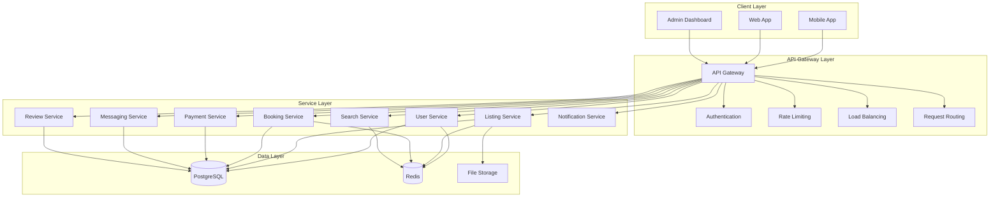
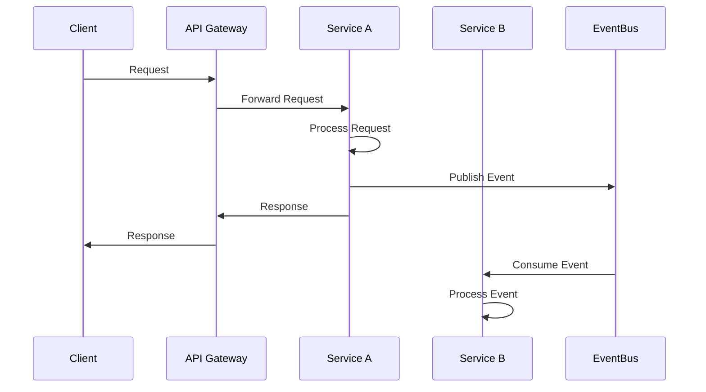
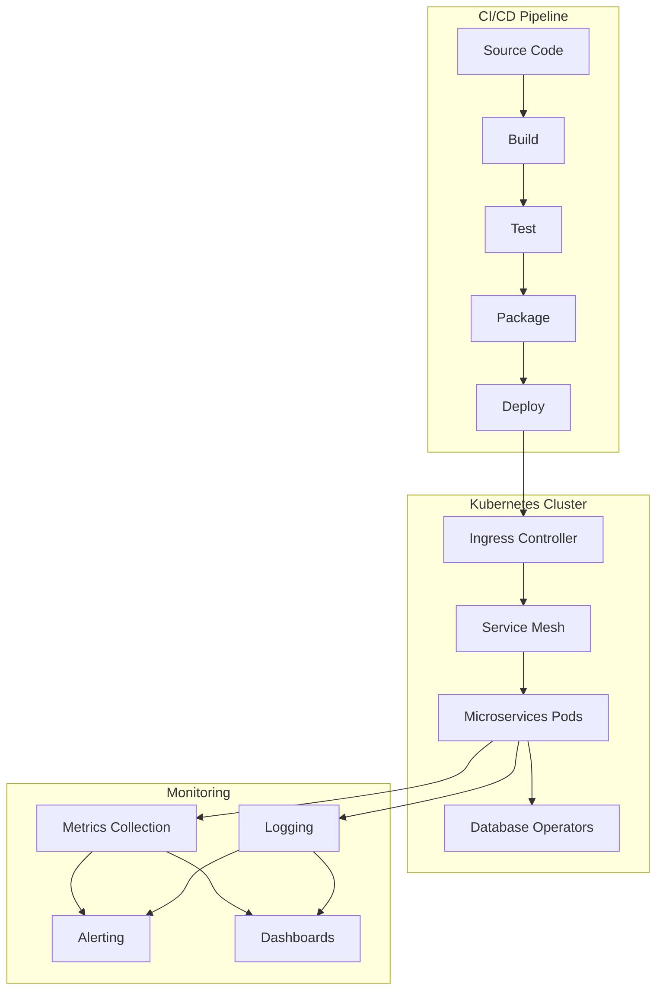

# Dokkerr System Architecture

This document provides a comprehensive overview of the Dokkerr system architecture, explaining the design decisions, component interactions, and technology choices that shape our platform.

## Architectural Overview

Dokkerr follows a microservices architecture with a clear separation of concerns. This approach enables our team to develop, deploy, and scale individual components independently.

## Key Architecture Principles

Dokkerr's architecture is guided by the following principles:

1. **Separation of Concerns**: Each service has a distinct responsibility and domain.
2. **Scalability**: Services can be scaled independently based on load requirements.
3. **Resiliency**: The system is designed to handle failures gracefully.
4. **Security**: Multiple layers of security controls protect user data and system integrity.
5. **Maintainability**: Code is organized to facilitate maintenance and extension.
6. **Performance**: The architecture optimizes for response time and resource efficiency.

## System Component Details

### Client Layer

The client layer consists of applications that users interact with directly:

- **Mobile Application**: Native iOS and Android applications built with React Native
- **Web Application**: React-based web application providing the same functionality as the mobile app
- **Admin Dashboard**: Internal tool for system administrators and support staff

### API Gateway Layer

The API Gateway serves as the entry point for all client requests:

- **Authentication**: Validates user identity and issues JWT tokens
- **Rate Limiting**: Protects services from excessive requests
- **Load Balancing**: Distributes traffic across service instances
- **Request Routing**: Directs requests to appropriate services

### Service Layer

The service layer contains the core business logic of the application:

- **User Service**: Manages user accounts, profiles, and authentication
- **Listing Service**: Handles dock listings, availability, and search
- **Booking Service**: Processes booking requests and manages reservations
- **Payment Service**: Handles payment processing and financial transactions
- **Messaging Service**: Manages conversations between users
- **Review Service**: Handles ratings and reviews for listings and users
- **Search Service**: Provides optimized search functionality with geospatial capabilities
- **Notification Service**: Manages email, SMS, and push notifications

### Data Layer

The data layer stores and manages application data:

- **PostgreSQL**: Primary relational database for structured data
- **Redis**: In-memory data store for caching and real-time functionality
- **File Storage**: S3-compatible storage for images and documents

## Communication Patterns

Services communicate using a combination of synchronous and asynchronous patterns:

### Synchronous Communication

- **REST APIs**: Standard HTTP-based communication between services
- **GraphQL**: Used for complex data queries from client applications

### Asynchronous Communication

- **Event Bus**: For propagating events between services
- **Message Queues**: For handling background processing tasks
- **WebSockets**: For real-time communication with clients

## Scalability Strategy

Dokkerr's architecture is designed to scale horizontally to handle increased load:

- **Stateless Services**: All services are designed to be stateless, allowing for easy horizontal scaling
- **Database Sharding**: For distributing database load across multiple instances
- **Caching Strategy**: Multi-level caching to reduce database load
- **Auto-scaling**: Services automatically scale based on predefined metrics

### Scaling Dimensions

- **Geographic Scaling**: Deployment across multiple regions for lower latency
- **Load Scaling**: Increasing capacity to handle more concurrent users
- **Storage Scaling**: Expanding storage capacity for growing data needs

## Security Architecture

Security is implemented at multiple levels:

- **Authentication**: JWT-based authentication with secure token management
- **Authorization**: Role-based access control for all resources
- **API Security**: Input validation, rate limiting, and request signing
- **Data Protection**: Encryption at rest and in transit
- **Infrastructure Security**: Network isolation, firewalls, and intrusion detection

## Deployment Architecture

Dokkerr is deployed using containerization and orchestration:

### Deployment Process

1. **CI/CD Pipeline**: Automated testing and deployment pipeline
2. **Container Orchestration**: Kubernetes for managing container deployment
3. **Infrastructure as Code**: All infrastructure defined and versioned as code
4. **Multiple Environments**: Development, staging, and production environments

## Technology Stack

### Frontend Technologies
- React / React Native
- TypeScript
- Redux
- Material UI / React Native Elements

### Backend Technologies
- Node.js
- Express
- TypeScript
- PostgreSQL
- Redis
- Socket.IO

### Infrastructure Technologies
- Docker
- Kubernetes
- AWS/GCP/Azure
- Terraform
- CI/CD: GitHub Actions

## Monitoring and Observability

The system includes comprehensive monitoring:

- **Application Metrics**: Response times, error rates, throughput
- **Infrastructure Metrics**: CPU, memory, disk usage
- **Business Metrics**: Bookings, listings, revenue
- **Logging**: Centralized logging with structured log formats
- **Tracing**: Distributed tracing for request flows
- **Alerting**: Automated alerts for critical issues

## Disaster Recovery

The disaster recovery strategy includes:

- **Regular Backups**: Automated database backups
- **Multi-region Deployment**: For high availability
- **Failover Mechanisms**: Automatic recovery from failures
- **Recovery Testing**: Regular testing of recovery procedures

## Evolution & Future Architecture

The architecture is designed to evolve over time:

- **Service Extraction**: Breaking down larger services as needed
- **New Capabilities**: Adding new services for emerging requirements
- **Performance Optimization**: Continuous improvement based on metrics
- **Technology Upgrades**: Adopting new technologies as appropriate

## Architecture Decision Records

Key architectural decisions are documented in Architecture Decision Records (ADRs):

- [ADR-001: Service Decomposition Strategy](../architecture/adrs/001-service-decomposition.md)
- [ADR-002: Authentication Mechanism](../architecture/adrs/002-authentication.md)
- [ADR-003: Database Technology Selection](../architecture/adrs/003-database.md)
- [ADR-004: API Design Philosophy](../architecture/adrs/004-api-design.md)

## Resources

- [System Design](../architecture/system-design.md)
- [Design Patterns](../architecture/design-patterns.md)
- [Scalability](../architecture/scalability.md)
- [API Documentation](./api-endpoints.md)
- [Database Schema](./database-schema.md) 